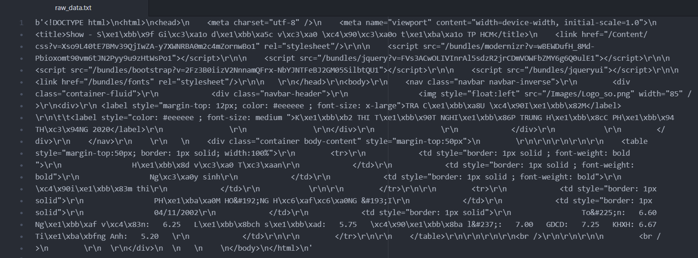

# Analysis: National High School Exam score of HCMC students in 2020

The project collect the scores from the National High School Exam of Ho Chi Minh City (HCMC) students in 2020. Then, we will analyze the data to assess the performance and quality of this Exam as well as the high school education status in HCMC. Last, I will suggest some ideas and solutions for possible issues.

The analysis process:
- Step 1: [Data collection](#1-data-collection)
- Step 2: [Data cleaning](#2-data-cleaning)
- Step 3: [Analysis and visualization](#3-analysis-and-visualization)

## 1. Data collection
 
Use the programming language Python and command curl to collect the public data from the website https://diemthi.hcm.edu.vn and save as the file *raw_data.txt*.

***Python code for data collection: [curl-all.py](curl-all.py)***
```python
import subprocess 

# set the starting and ending student ID
start = 2000001
end = 2074719

# create the raw data file
file = open("raw_data.txt", "w")

# create the loop of all student IDs
for sbd in range(start,end):
	command = 'curl -F "SoBaoDanh=0' + str(sbd) + '" diemthi.hcm.edu.vn/Home/Show'
	result = subprocess.check_output(command)

	file.write(str(result) + "\n")
```
We have to manually find the pattern of student ID that is in range of 02000001 and 02074719.

This is the example of the raw data we get from 1 student ID:



You can get the result file in our [Google Drive](https://drive.google.com/file/d/1DJFrIP4VwuXNyjLgYpHztnqzw04BJcPb/view?usp=sharing) (GitHub has a strict file limit of 100MB, so we have to use the cloud service of a third party for storage)

## 2. Data cleaning

In this step, we need to remove the unexpected characters and reorganize the data to get the clean data.

***Python code for data cleaning: [process_all.py](process_all.py)***
```python
import csv
file = open("raw_data.txt", "r")

# Read file, create a list of raw data
datas = file.read().split("\n")

# write header to csv (result file)
with open("clean_data.csv", encoding="utf8", mode="w", newline='') as file_csv:
	header = ["sbd", "tên", "dd", "mm", "yy", "toán", "ngữ văn", "khxh", "khtn", "lịch sử", "địa lí", "gdcd", "sinh học", "vật lí", "hóa học", "tiếng anh"]
	writer = csv.writer(file_csv)
	writer.writerow(header)

# set the starting student ID 
sbd = 2000000

# clean data for one student and iterate this process for all student ID
for data in datas:
	sbd += 1
	# skip the faulty student ID (manual collection)
	if sbd in [2000521,2002776,2002833,2005380,2005472,2005733,2005820,2005876,2006091,2006300,2006364,2006544,2006712,2006720,2006904,2008746,2009196,2012503,2019593,2020755,2024536,2027212,2031588,2031948,2035434,2036693,2042067,2042972,2043577,2044668,2046177,2046483,2046496,2046651,2046766,2046771,2046788,2046810,2046841,2046998,2047031,2047122,2047241,2047273,2047304,2047486,2047636,2047834,2047843,2047856,2047865,2048225,2048271,2048279,2048397,2048424,2048427,2048592,2048660,2048701,2048723,2048858,2049069,2049090,2049104,2049164,2049234,2049312,2049383,2049663,2049763,2049775,2049891,2049971,2050378,2050476,2050488,2050516,2050526,2050540,2050576,2050642,2050649,2050722,2050809,2050814,2050899,2050959,2050978,2050984,2050985,2051006,2051072,2051181,2051191,2051234,2051422,2051468,2051472,2051495,2051615,2051616,2051736,2052013,2052030,2052089,2052314,2052373,2052591,2052663,2052711,2052791,2052856,2053000,2053106,2053259,2053593,2053699,2053860,2054235,2054306,2054374,2054508,2054733,2054787,2055119,2055200,2055290,2055296,2055606,2055683,2055803,2055829,2055912,2055930,2055986,2056020,2056032,2056105,2056139,2056186,2056190,2056238,2056273,2056291,2056298,2056333,2056350,2056377,2056393,2056782,2056823,2056865,2056871,2057014,2057294,2057410,2057496,2058404,2058498,2058518,2058789,2058938,2059095,2059163,2059740,2059751,2059769,2059774,2059807,2059852,2060462,2060492,2060536,2060610,2060652,2060656,2060660,2060730,2060738,2061813,2062212,2062236,2062391,2062440,2062898,2063109,2063114,2063179,2063180,2063181,2063207,2063272,2063653,2063707,2063716,2063752,2063754,2063825,2064369,2064704,2064783,2064990,2065104,2065323,2065604,2065877,2065995,2066106,2066212,2066835,2067172,2067291,2067316,2067371,2067383,2067401,2067446,2067467,2067550,2067563,2067659,2067672,2067698,2067762,2067909,2067971,2067996,2068089,2068119,2068156,2068174,2068178,2068243,2068287,2068365,2068382,2068427,2068453,2068548,2068550,2068627,2068667,2068702,2068732,2068846,2068970,2069028,2069043,2069066,2069156,2069290,2069362,2069397,2069843,2069990,2070203,2070870,2071102,2071574,2072480,2072549,2072755,2072823,2073036,2073372,2073477,2073556,2073964,2074135,2074254,2074281,2074367,2074607,2074719]:
		continue
	sbd_str = "0" + str(sbd)

	# make data becomes a list
	data  = data.split("\\n")

	# remove \r and \t tag
	for i in range(len(data)):
		data[i] = data[i].replace("\\r", "")
		data[i] = data[i].replace("\\t", "")

	# remove other tags (not necessary for analysis)
	for i in range(len(data)):
		tags = []
		for j in range(len(data[i])):
			if data[i][j] == "<":
				begin = j
			if data[i][j] == ">":
				end = j
				tags.append(data[i][begin:end+1])

		for tag in tags:
			data[i] = data[i].replace(tag, "")

	# remove leading whitespace
	for i in range(len(data)):
		data[i] = data[i].strip()

	# remove empty line
	unempty_lines = []
	for i in range(len(data)):
		if data[i] != "":
			unempty_lines.append(data[i])
	data = unempty_lines

	# choose relevant information
	name = data[7]
	dob = data[8]
	scores = data[9]

	# load unicode table (manual collection)
	chars = [] # special characters
	codes = [] # code of special characters

	file = open("unicode.txt", encoding="utf8")
	unicode_table = file.read().split("\n")

	for code in unicode_table:
		x = code.split(" ")
		chars.append(x[0])
		codes.append(x[1])

	# replace special characters in name and scores
	for i in range(len(chars)):
		name = name.replace(codes[i], chars[i])
		scores = scores.replace(codes[i], chars[i])

	# replace web code to character in name
	for i in range(len(name)):
		if name[i:i+2] == "&#":
			name = name[:i] + chr(int(name[i+2:i+5])) + name[i+6:]

	# replace web code to character in scores
	for i in range(len(scores)):
		if scores[i:i+2] == "&#":
			scores = scores[:i] + chr(int(scores[i+2:i+5])) + scores[i+6:]

	# change to lower case
	name = name.lower()
	scores = scores.lower()

	# split dob
	dob_list = dob.split("/")
	dd = int(dob_list[0])
	mm = int(dob_list[1])
	yy = int(dob_list[2])

	# process scores
	# remove :
	scores = scores.replace(":", "")

	scores = scores.replace("khxh ","khxh   ")
	scores = scores.replace("khtn ","khtn   ")

	scores_list = scores.split("   ")
	data = [sbd_str, name.title(), str(dd), str(mm), str(yy)]

	# add score to data
	for subject in ["toán", "ngữ văn", "khxh", "khtn", "lịch sử", "địa lí", "gdcd", "sinh học", "vật lí", "hóa học", "tiếng anh"]:
		if subject in scores_list:
			subject_name_position = scores_list.index(subject)
			subject_score_position = subject_name_position + 1
			subject_score = scores_list[subject_score_position]
			data.append(str(subject_score))
		else:
			data.append("-1")

	# write data to csv
	with open("clean_data.csv", "a", encoding='utf-8', newline='') as file_csv:
		writer = csv.writer(file_csv)
		writer.writerow(data)

```
The file *[unicode.txt](unicode.txt)* used for decoding the Vietnamese characters.


This is the example of the clean data we collected in the file *[clean_data.csv](clean_data.csv)*:


**The score of subjects not participated is filled by -1.*

## 3. Analysis and visualization

Using this set of data, we can answer many questions from educational management departments or the universities.

These are some issues that these data can address.

### 3.1. Social Science and Natural Science

The Vietnamese government want the technology and industry sector develop more. Therefore, they demand the education system focus on natural science. <br>	
Then, the educational managers need to know *whether Vietnamese students prefer natural science to social science* to plan the suitable strategy to orientate the education system.<br>
If students like social science subjects, educational managers need to run some marketing campaigns to propagate the message that students should focus more on natural science (message about natural science's benefits).

The question: **Do Vietnamese students prefer natural science to social science?**

We can use the data of number of students registering for social science and natural science.<br>
**In Vietnamese, social science is khoa học xã hội (khxh) and natural science is khoa học tự nhiên (khtn)*

```python
import pandas as pd
import matplotlib.pyplot as plt
import numpy

data = pd.read_csv("clean_data.csv")
subjects = ["social science", "natural science"]

# number of students registering social science
ss_count = data[data["khxh"]>=0]["khxh"].count()

# number of students registering natural science
ns_count = data[data["khtn"]>=0]["khtn"].count()

total_student = len(data)
take_exam = [ss_count, ns_count]
take_exam_percentage = [0,0]

take_exam_str = [0, 0]
take_exam_percentage_str = [0,0]

# convert to percentage
for i in range(0,2):
	take_exam_percentage[i] = round(take_exam[i]*100/total_student, 2)

# convert to string
for i in range(0,2):
	take_exam_percentage_str[i] = str(take_exam_percentage[i]) + "%"
for i in range(0,2):
	take_exam_str[i] = "{:,}".format(take_exam[i])

print(take_exam_str)
# plot barchart
figure, axis = plt.subplots()

# list from 0-1
y_pos = numpy.arange(len(subjects))

# plot the barchart using 2 list
plt.bar(y_pos, take_exam_percentage, color=["#ff6358","#2d73f5"])

# change horizontal category name
plt.xticks(y_pos, subjects)

# set limit to vertical axis
axis.set_ylim(0,100)

# label and title
plt.ylabel('Percentage')
plt.title('Number of students participating in the exam')

# Draw number of student on top of each bar
# https://stackoverflow.com/questions/28931224/adding-value-labels-on-a-matplotlib-bar-chart
rects = axis.patches
for rect, label1, label2 in zip(rects, take_exam_str, take_exam_percentage_str):
    height = rect.get_height()
    axis.text(rect.get_x() + rect.get_width() / 2, height + 2, label1, ha='center', va='bottom')
    axis.text(rect.get_x() + rect.get_width() / 2, height/2, label2, ha='center', va='center')

# show the plot
plt.show()
```
The result is showed below:


We can conclude that students in HCMC prefer natural science because they participate in natural science exam more than social science one (56% > 34%).

The educational managers do not need to run many marketing campaigns because the real situation is supporting the government's orientation for the economy.

### 3.2. The correlation between the number of exams participated and average score

The students in HCMC want to know whether the average score decrease when the number of subject exam students participate in increase. If this hypothesis is true, they will focus on the limited number of necessary subjects. If it is false, they will participate in many exams.

The question: **Does the average score decrease when the number of subject exam students participate in increase?**

We can use linear regression to find the correlation between the number of exams participated and average score.

```python
import numpy as np
import matplotlib.pyplot as plt
import pandas as pd

data = pd.read_csv("clean_data.csv")

data = data.replace(-1,None)
data["Average"] = data[['toán', 'ngữ văn', 'khxh', 'khtn', 'lịch sử', 'địa lí', 'gdcd', 'sinh học', 'vật lí', 'hóa học', 'tiếng anh']].mean(axis = 1)
data["Count"] = data[['toán', 'ngữ văn', 'khxh', 'khtn', 'lịch sử', 'địa lí', 'gdcd', 'sinh học', 'vật lí', 'hóa học', 'tiếng anh']].count(axis = 1)

average_score = data["Average"].tolist()
count_exam = data["Count"].tolist()

# plot the linear regression chart
def estimate_coef(x, y):
	# number of observations/points
	n = np.size(x)

	# mean of x and y vector
	m_x = np.mean(x)
	m_y = np.mean(y)

	# calculating cross-deviation and deviation about x
	SS_xy = np.sum(y*x) - n*m_y*m_x
	SS_xx = np.sum(x*x) - n*m_x*m_x

	# calculating regression coefficients
	b_1 = SS_xy / SS_xx
	b_0 = m_y - b_1*m_x

	return (b_0, b_1)

def plot_regression_line(x, y, b):
	# plotting the actual points as scatter plot
	plt.scatter(x, y, color = "#2d73f5",
			marker = "o", s = 30)

	# predicted response vector
	y_pred = b[0] + b[1]*x

	# plotting the regression line
	plt.plot(x, y_pred, color = "#ff6358")

	# putting labels
	plt.xlabel('Number of exams participated')
	plt.ylabel('Average score')

	# function to show plot
	plt.show()

def main():
	# observations / data
	x = np.array(count_exam)
	y = np.array(average_score)

	# estimating coefficients
	b = estimate_coef(x, y)
	print("Estimated coefficients:\nb_0 = {:.2f} \
		\nb_1 = {:.2f}".format(b[0], b[1]))

	correlation_matrix = np.corrcoef(count_exam, average_score)
	correlation_xy = correlation_matrix[0,1]
	r_squared = correlation_xy**2

	print("R^2 = " + str(round(r_squared, 2)))

	# plotting regression line
	plot_regression_line(x, y, b)

if __name__ == "__main__":
	main()
```
The result is showed below:


```
Estimated coefficients:
b_0 = 5.80 (intercept)
b_1 = 0.11 (slope, regression coefficient)
R^2 = 0.02
``` 
We can see that there is almost no correlation between the number of exams participated and average score because the R-squared **R^2 = 0.02** (should be more than 0.6) and the regression coefficient (slope) **B1 = 0.11** is small (having little influence on the average score if change the number of exam participated).

### 3.3. The distribution of the score of Math

Educational managers want to evaluate the quality of the Math exam in the aspect of score. They want the 80% of students get a score above 5 and the median is in the range of 6.5 - 7.0.

We did an analysis to answer whether this Math exam can meet these requirements.

We need to find the median and the 20th percentile of the Math score set.

```python
import numpy as np
import matplotlib.pyplot as plt
import pandas as pd

data = pd.read_csv("clean_data.csv")
data = data[~(data['toán'] == -1)]
math_score_list = data['toán'].tolist()

math_score_list_array = np.array(math_score_list)
math_median = np.percentile(math_score_list_array, 50)
math_percentile20 = np.percentile(math_score_list_array, 20)

print("Median = " + str(math_median))
print("20th Percentile = " + str(math_percentile20))

# Draw the histogram chart
plt.hist(math_score_list, bins=50, color = "#2d73f5")
plt.xticks(np.arange(0, 10.2, 0.2), rotation="vertical")

plt.axvline(math_median, color = "#ff6358", linewidth=2)
plt.axvline(math_percentile20, color = "#ffd246", linewidth=2)

plt.text(math_median + 0.1, 200, "Median = " + str(math_median), rotation=90, verticalalignment="bottom")
plt.text(math_percentile20 + 0.1, 200, "20th Percentile = " + str(math_percentile20), rotation=90, verticalalignment="bottom")

plt.title("The distribution of Math score")
plt.xlabel('Score')
plt.ylabel('Frequency')

plt.show()
```

The result is showed below:


```
Median = 7.6
20th Percentile = 6.4
``` 
We can see that the median of this set is out of the expected score range 6.5 - 7.0 (not satisfied) but 80% of students get Math score above 5.0 (satisfied), so the Math exam did not meet totally the requirements from the educational managers.<br>
The exam maker need to increase the difficulty level of the hard questions or increase the number of hard question, this can lead to the decrease of median and be useful for student classification.
